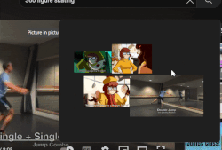
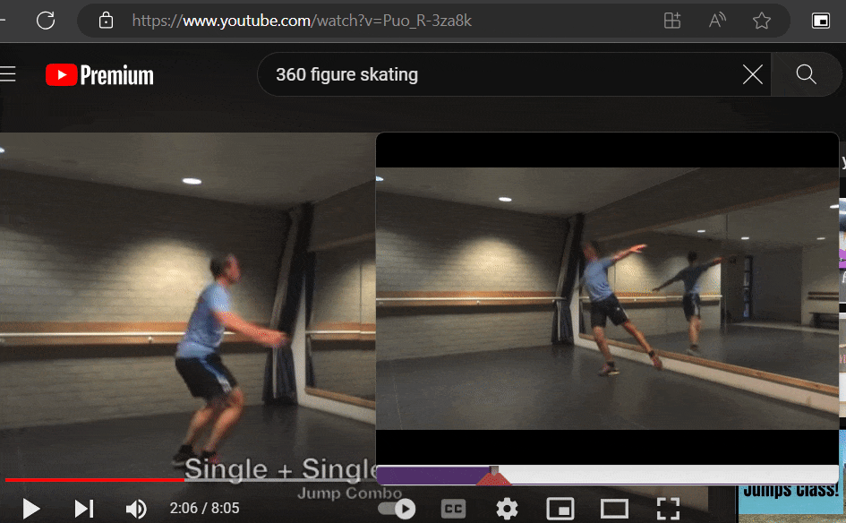

# Why?
This is a remake/clone of pureRef, a program that allows you to view images on top of other windows. This is useful for artists who want to reference images while drawing, or for people who want to view images while playing games. Where pureRef-animated differs is it adds gif, video, and youtube support. The movement of a video for a reference offers a lot of information like depth and scale that a still image can't. This is one of the key parts of what make in person figure drawing so important. It also seems like pureref has no intention of ever adding this feature. You should still support pureRef if you can.  

# Example Previews

### Youtube video trimming to loop only a specific portion

# How to use
Download from releases here: [Releases](https://github.com/lettucegoblin/pureref-gif-support/releases)
Windows, Mac, and linux support(need testing on mac and linux; If you're on these platforms please mention how they are in the issues)
